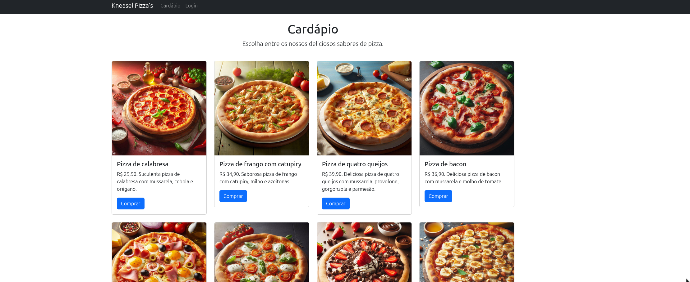
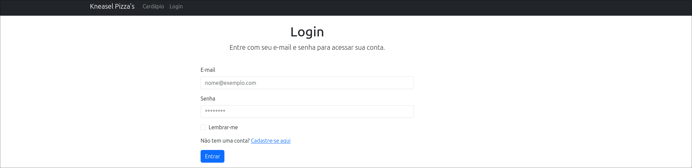

# Kneasel Pizza's

Este é um projeto de um site para a pizzaria fictícia Kneasel Pizza's, desenvolvido utilizando HTML, CSS, JavaScript, PHP e MySQL. O objetivo é apresentar o cardápio da pizzaria, permitir o cadastro de clientes e simular um sistema de pedidos.

## Tecnologias Utilizadas

- HTML5 e CSS3: Estruturação e estilização das páginas.
- Bootstrap 5: Framework CSS para design responsivo e moderno.
- JavaScript: Interatividade e dinamismo no site.
- PHP: Backend para processar formulários e interagir com o banco de dados.
- MySQL: Banco de dados para armazenar informações de clientes e pedidos.

## Funcionalidades

- Página Inicial: Apresentação da pizzaria e informações de contato.
- Cardápio: Exibição das pizzas disponíveis.
- Cadastro de Clientes: Formulário para registro de novos clientes com criptografia de senhas.
- Login: Sistema de autenticação para clientes.
- Banco de Dados: Armazena dados dos clientes com senha criptografada utilizando password_hash.

